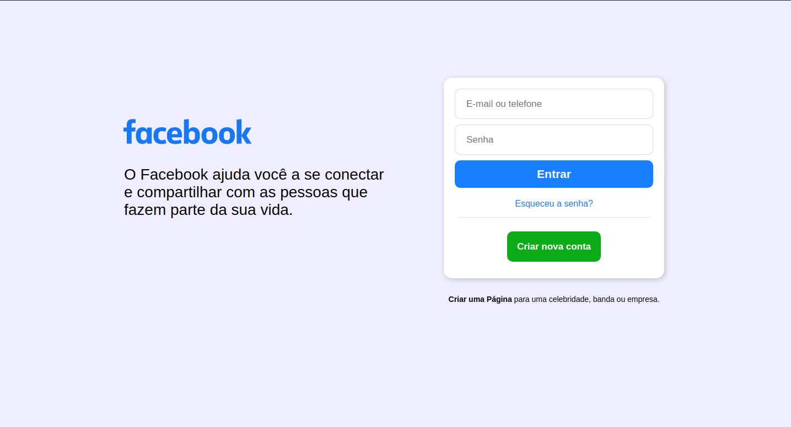

<h4 align="center" width="100%">
  
</h4>

<p align="center">
 <a href="#-sobre-o-projeto">Sobre</a> •
 <a href="#-layout">Layout</a> • 
 <a href="#-como-executar-o-projeto">Como executar</a> • 
 <a href="#-tecnologias">Tecnologias</a> • 
</p>

---

## 💻 Sobre o projeto

O [**Facebook**](https://www.facebook.com/) é uma das maiores rede social do mundo, com mais de 2 bilhões de usuários ativos. De acordo com [**Mark Zuckerberg**](https://www.facebook.com/zuck), o objetivo da rede social é conectar pessoas, criando um mundo mais transparente.Nesse projetinho fiz a pagina de login do facebook com responsividade para dasktop, tablets e dispositivos moveis.

## 🎨 Layout
<div align="center">
  
</div>

---

## 🚀 Como executar o projeto

```bash
## Primeiro e preciso clonar este repositóro na sua maquina
$ git clone https://github.com/Diego-DevsS/htmlCssJs/Facebook_loginPage

## Apos clonar o repositorio e so entrar na pasta
$ cd SimpleHtmlCssJs/Facebook_loginPage

## E Abrir o arquivo principal no seu navegar padrão

```

### ou apenas clique no link abaixo
<br>

[](https://facebook-login-nu.vercel.app/)

---

## 🛠 Tecnologias


---

## 🛠 Tecnologias

* HTML
* CSS

